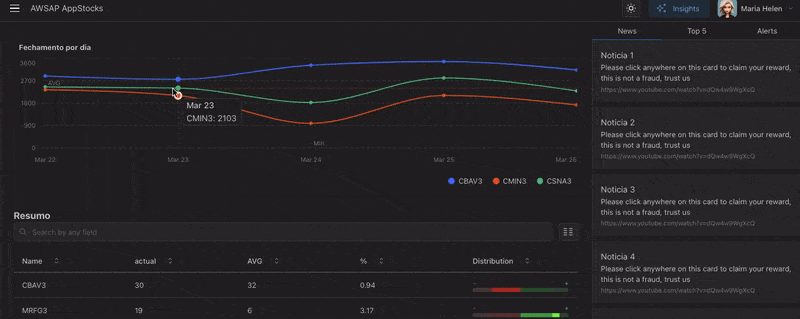

# appstocks
Aplicação para monitoramento de ações BR



### Recursos utilizados na aplicação:

Create a new project 'frontend' **React** with **Vite** and **Yarn**
```c
yarn create vite frontend --template react
```

Change directory:
```c
cd frontend
```

Add libs:
```
yarn add @mantine/core @mantine/hooks @mantine/dates dayjs @mantine/charts recharts@2 @mantine/notifications @mantine/code-highlight @mantine/spotlight @tabler/icons-react
yarn add --dev postcss postcss-preset-mantine postcss-simple-vars
yarn add lodash.debounce
```

Create file: `/postcss.config.cjs`


Remind of include lines in main.jsx:
```js
import { MantineProvider } from '@mantine/core';
import '@mantine/core/styles.css';
```

To finish (output into folder `dist`)
```c
yarn build
```

For Publish web on Site: Surge
Install Surge:
```
yarn global add surge
```
Into folder `dist` run `surge`


Another modes to create new Project:
Create new app with Vite
```c 
npm create vite@latest frontend
... select React, TypeScript + SWC
npm install
```
or Yarn
```c
yarn create react-app frontend
```

Start of project with **Yarn** and **Vite**:
```c
yarn dev
```


Exemplo de skeleton:
```jsx
{Array(15)
  .fill(0)
  .map((_, index) => (
  <Skeleton key={index} h={28} mt="sm" animate={false} />
))}
```
